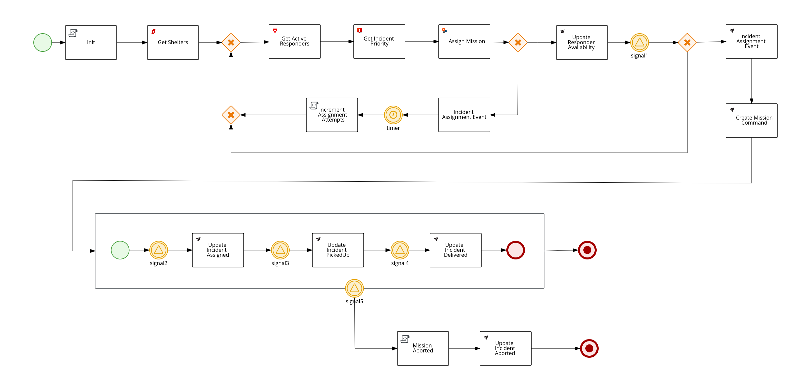

#### Process Service for the Red Hat Cajun Navy Demo

Please see the following for more details:  https://www.erdemo.io/architecture/#3-process-service

* RHPAM 7.9 process engine embedded in a Spring Boot 2.2.6 application
* Process orchestrates incident, responder and mission services by consuming and sending messages to Kafka queues.
* Current state of the process - WIP:

  
